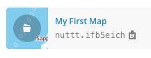

MoodMap (Data Visualization)
===============
Introduction & Demo
-------------------
Click to view:
[](https://drive.google.com/file/d/0B_pDRSQKQvxoS0VYcy1HRGl0SHM/edit)

[](https://drive.google.com/file/d/0B_pDRSQKQvxoS0VYcy1HRGl0SHM/edit)

Description
------------
Moodmap is a beautiful simple visualization of [Sunnycomb](http://sunnycomb.com/) (Instagram app of weather) that display summarization of emotion of people in each region. View weather and people’s reaction!

Features
--------
- See what people feels in each region, or country.
- Real-time update for monitoring changes around the world.
- Peek a beautiful sky or city from many people around the world.

System Design
-------------


The data is retreived via an available script (from WeatherNews) which outputs daily reports in JSON format. Then some APIs are created to manipulate the data into the desired structure that can be used in the front-end easily. The front-end displays the map with the data that is got from the APIs.

Architecture
------------


The architectures can be explained better from the ground-up:

The data are retrieved from three sources:

1. **Report Data**: reports are retrieved from the database of SunnyComb via a CGI script written by WNI staff

2. **Country Data**: country data is static (it does not update or change) and is used for lookup country’s latitude and longtitude only, the data is in the JavaScript Object form, ready to use just to import the library.

3. **City Data**: since there is no global city data in the report data (the report has a location attribute which records the city where the photo is taken, but the location is in the local language of the user), the english city name is retrieved via an API from openstreetmap. We enter the city name and get the value of latitude, longitude, and city name in english language in return. Then the data requested from openstreetmap will be saved to the ‘City Data’, which is the persistent data storage in JSON format powered by [NeDB](https://github.com/louischatriot/nedb). NeDB is like MongoDB but simpler and required nothing except a library).

The APIs is written in JavaScript language using Node.js as the platform.

The user interface is rendered using Web HTML/CSS and JavaScript. jQuery is the main JavaScript library used for manipulating HTML doms. MapBox is the service we used for rendering map.


Installation
------------
### API
1. The API is run on Node.js so that you need to install [Node.js framework](http://nodejs.org/) first

2. Download the [source code](https://github.com/nuttt/moodmap-wni) from GitHub repository

3. Extract the file and run `npm install` in the terminal or command prompt in the folder where app.js locates

4. Run `node app.js` in the terminal to start the server, the server is run on port 8080. An example of API access is [http://localhost:8080/location/2](http://localhost:8080/location/2)

### Front-End
1. First, you need to have a MapBox API key for custom maps. So you need to create an account in mapbox.com and create a custom map and grab a key. You can also customize the map color you want. My recommendation is `#62d2cb` for water color and `#fbfbfb` for land color in order to match perfectly with other component’s color of moodmap

   
 
   For example, this map key is `nuttt.ifb5eich`

   Please note the free version can hold up to 3000 map views per month which is enough for internal usage.

2. Download [source code](https://github.com/nuttt/moodmap-wni-client) from github.

3. Edit `MAPBOX_REF` under `js/main.js` and put in your mapbox map key.

4. Edit `DATA_POINT_URL`, `POINT_INFO_URL`, `REPORT_INFO_URL` to match with API url installed above. Use `{level}` and `{id}` for placeholder in url for detail level and report id.

   For example, if the API run on `localhost:8080`, you can config like this:

   ```
   var DATA_POINT_URL = 'http://localhost:8080/location/{level}';
   var POINT_INFO_URL = 'http://localhost:8080/info/{level}/{id}';
   var REPORT_INFO_URL = 'http://localhost:8080/report/{id}';
   ```

5. Open `index.html` to view the moodmap.

Problems & Improvements
-----------------------
1. The ‘city view’ is not perfectly rendered. Because cities are grouped by ‘location’ value in report data and the location value is in local language depending on the users’ phone language.

   __Suggested solutions:__
Create a mapping between english city name and its name in other languages and group cities by english city name instead
Record the location value in english name

2. The system is currently not scalable, for example, in the case that there are millions of reports in a day, it would be hard to evaluate

   __Suggested solutions:__
Cache the API data so that the server do not have to evaluate millions of reports every time, and re-evaluate the data every minute


Acknowledgement
---------------
- SOIAsia, WeatherNews for the internship opportunity to work on an amazing product.
- Coders:
  - Vee Trairattanapa ([withlovee](http://github.com/withlovee))
  - Nuttapon Pattavijit ([nuttt](http://github.com/nuttt))
